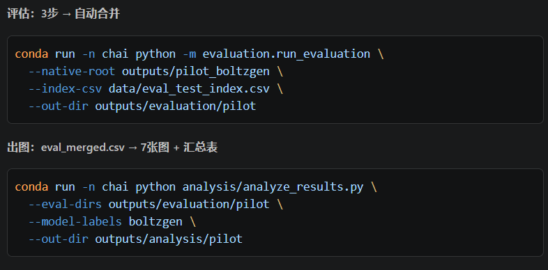

问题总结：
    1.评估的时候公平吗？每个模型按照各自合理参数跑，boltzgen和rfantibody这里都是内部没有过滤的，而且mber和germinal内部是需要过滤的，以我的理解，如果是对于同一个靶点，同样生成100个候选，自然是含有过滤的这组性能最好啊，这样还有可比性吗？

    回答：对于每个模型，最好的情况是按照默认参数运行，这里对于每个模型会生成数量不一致的一批候选，评估的时候可以按照模型里面内置的指标取每个模型的top10或者top20（数量不能超过50）放进chai-1里，但只放top10（数量肯定是小于50的）跑evaluation整个流程，目前evaluation整个设计有没有问题。比如step1、step2、step3应该是不用改的。但这里的step聚类数，候选数量很少，聚类的结果也很少，这样还有意义吗？或者可以先把结果跑出来，然后统一一下，如果数量少的话，就去掉这一步，多的话可以在做聚类。第二点：考虑到每个模型内部过滤产生的时间成本，到analysis这一步的时间必须要报告效率指标，包含每个靶点的 GPU 小时数和每个通过质量阈值的候选的平均 GPU 耗时。第三点analysis这块取top10的逻辑需要去掉。目前还缺少一步：应该是要把原来的抗体序列输进去作为基准，然后评估一下。后面要安装一下pyrosetta，做step2物理/几何维度的评估
    

    8.data_prep下的三个脚本做的事：prepare_native_inputs.py:下载各个靶点的pdb，同时调用extract_epitopes_from_complexes.py提取表位，我设想是否只需要对这里的大抗原（大于300）这组做裁剪，中等抗原（200--300）是否做裁剪待定

    
    目前evaluation这里只有质量评估，好像没有效率评估呢？就是每个靶点的 GPU 小时数和每个通过质量阈值的候选的平均 GPU 耗时。同时我是否需要加入一个阈值，作为鲁棒性评估，里面有成功率啥的
   
   analysis这里需要：加入天然抗体的评估指标，其中Native 会以黑色线条 / 柱子出现，作为黄金标准基准。

思路总结：
    1.关于论文：我需要补充以下的图片：1.流程图 2.一个excel表格，类似这样/home/yqsong/projects/antibody_benchmark/AntibodyBench/assets/屏幕截图 2026-04-10 003918.png 3.四个模型的3D结构对比图类似这样/home/yqsong/projects/antibody_benchmark/AntibodyBench/assets/屏幕截图 2026-04-10 004304.png 4.数据集画像：抗原长度分布直方图，x轴表示抗原氨基酸数量，y轴表示有多少个靶点落在这个区间，有小抗原、中抗原、大抗原这几类
 
    2.本项目的定位是"In silico benchmarking"，evaluation pipeline设计思路如下：第一：Ai Metrics，这里选择了chai-1来提取iptm、ptm、pLDDT 第二：Pysics&Geometry:进行InterfaceAnalyzer计算,提取 ddG、Shape Complementarity (Sc)、dSASA。第三：developability 。整体上是这个思路，于4月10日又更新了序列聚类等几个参数，目前需要根据evaluation当前的代码重写里面的readme文档
    
    3.每次跑run.sh时候检查一下四个模型的源码对于输入的要求，尽量都提供表位信息，不能有的不提供有的提供。

    4.每次重构代码或者整个思路需要及时更新整个目录的readme

    5.这台服务器上是可以跑mber-open的，germinal是否可以正常运行有待解决，可以先做单样本验证，同时需要合理分配到空闲gpu做全量运行
    补充：tf服务器上运行不了germinal的原因是PyTorch 2.6.0 不支持 Blackwell GPU（sm_120），需升级到 PyTorch 2.7+，后面还需要配置环境吗？或者是否可以在docker容器里面跑呢？我只要把native_inputs输入，然后把超小靶点的三个设计得到就好了。这样是否可行呢？
    
    6.关于evaluation:1.chai-1到rosetta缺失了relaxation 2.缺少表位特异性评估模块，后面要补一个epitope_metrics.py3.缺少native pdb作为基准线，需要把纳米抗体—抗原复合物结构将这些天然复合物丢进与上述完全相同的打分Pipeline 中，获得它们的 ipTM、ddG、Sc 基准值。

    7.我把另一台服务器上跑的rfantibody的结果拿过来了，放在了这里/home/yqsong/projects/antibody_benchmark/AntibodyBench/outputs/pilot_rfantibody，这里每个靶点生成50*4个设计，等待后续进行下一步

    8.整个评估流程分为三步：一：chai-1打分（4*100*18个=7200序列），按每次约30-60秒估算，单 GPU 约需 60-120小时，如果每个靶点生成500个候选vhh，这样不太现实了。二：Rosetta relaxation + InterfaceAnalyzer三：序列分析耗时较短。

    9.目前的更新的evaluation pipeline设计思路:
图表总结：
    1.关于analysis模块：运行完会得到这些图片：outputs/analysis/thesis_figures/
    ├── fig01_iptm_by_target.png/.pdf      # 图1: 各靶点iPTM评分
    ├── fig02_pdockq2_by_target.png/.pdf   # 图2: 各靶点pDockQ2评分
    ├── fig03_metric_distributions.png/.pdf # 图3: 指标分布小提琴图
    ├── fig04_iptm_vs_pdockq2.png/.pdf     # 图4: iPTM vs pDockQ2散点图
    ├── fig05_success_rate_curve.png/.pdf  # 图5: 累积成功率曲线
    ├── fig06_interface_heatmap.png/.pdf   # 图6: 界面指标热力图
    ├── fig07_sequence_analysis.png/.pdf   # 图7: 序列特征分析
    ├── fig08_model_comparison_radar.png/.pdf # 图8: 多模型雷达图(≥2模型时)
    ├── fig09_head_to_head.png/.pdf        # 图9: 模型胜率对比(≥2模型时)
    └── summary_table.csv                  # 汇总统计表

等 boltzgen 跑完空出 GPU 后，完整流程就是一条命令
    conda run -n chai python -m evaluation.run_evaluation \
  --native-root outputs/pilot_boltzgen \
  --index-csv data/eval_test_index.csv \
  --out-dir outputs/evaluation/pilot \
  --device cuda:0

  

  GPU 1 已被占用 77GB，mBER pilot 正在运行中。

状态总结：

tmux session mber_pilot 已启动
参数：num_accepted=100, max_traj=500，共 3 个样本（8dtn_A_B → 8hxq_A_B → 8qf4_A_B）
GPU 1 已分配 ~78GB，模型正在加载/运行
日志同时写入 outputs/pilot_mber_pilot.log
查看进度：tmux attach -t mber_pilot 或 tail -f outputs/pilot_mber_pilot.log